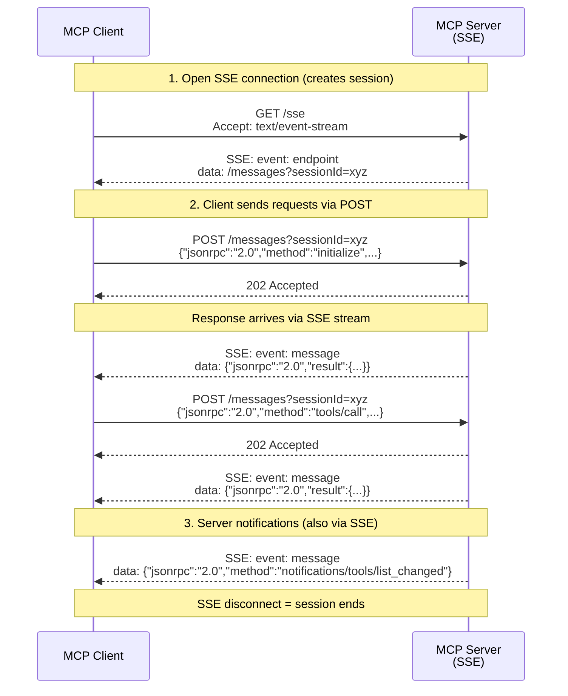

# SSE Transport (Legacy)

> **This project does not use SSE transport.** It uses [Streamable HTTP](transport-streamable-http.md). This page documents the legacy SSE transport for context — you may encounter it in older MCP servers, documentation, or tools.

The SSE (Server-Sent Events) transport was the original HTTP-based transport for MCP, used before the [2025-03-26 spec revision](https://modelcontextprotocol.io/specification/2025-03-26/basic/transports#streamable-http). It has been superseded by Streamable HTTP.

## How It Works

The SSE transport uses two separate endpoints:

1. **`GET /sse`** — client opens a long-lived SSE connection. The server sends an `endpoint` event containing a URL for the client to POST messages to.
2. **`POST /messages?sessionId=...`** — client sends JSON-RPC requests to this endpoint. Responses come back via the SSE stream, not as HTTP responses.

The SSE connection _is_ the session — if the connection drops, the session is lost.



### Request/response flow

Unlike Streamable HTTP where POST responses contain the JSON-RPC result directly, SSE transport returns `202 Accepted` for POSTs and delivers the actual response asynchronously through the SSE stream. The client must correlate responses by matching the JSON-RPC `id` field.

## Sample Payloads

### Open SSE connection

**Request:**
```http
GET /sse HTTP/1.1
Host: localhost:3000
Accept: text/event-stream
```

**Response (SSE stream begins):**
```http
HTTP/1.1 200 OK
Content-Type: text/event-stream
Cache-Control: no-cache
Connection: keep-alive

event: endpoint
data: /messages?sessionId=550e8400-e29b-41d4-a716-446655440000
```

### Send a request

**Request:**
```http
POST /messages?sessionId=550e8400-e29b-41d4-a716-446655440000 HTTP/1.1
Host: localhost:3000
Content-Type: application/json

{
  "jsonrpc": "2.0",
  "id": 1,
  "method": "initialize",
  "params": {
    "protocolVersion": "2024-11-05",
    "capabilities": {},
    "clientInfo": {
      "name": "my-client",
      "version": "1.0.0"
    }
  }
}
```

**HTTP Response (acknowledgement only):**
```http
HTTP/1.1 202 Accepted
```

**Actual response (via SSE stream):**
```
event: message
data: {"jsonrpc":"2.0","id":1,"result":{"protocolVersion":"2024-11-05","capabilities":{"tools":{}},"serverInfo":{"name":"example-server","version":"1.0.0"}}}
```

## Comparison with Streamable HTTP

| | SSE Transport (legacy) | Streamable HTTP (current) |
|---|---|---|
| **Spec version** | Pre-2025-03-26 | 2025-03-26+ |
| **Endpoints** | `GET /sse` + `POST /messages` | `POST /mcp` + `GET /mcp` |
| **Session management** | SSE connection = session | `Mcp-Session-Id` header |
| **Request/response** | POST returns 202, response via SSE | POST returns 200 with response body |
| **Connection requirement** | Long-lived SSE stream required | Stateless HTTP (SSE optional) |
| **Connection drops** | Session lost | Session survives (reconnect with ID) |
| **Serverless** | Not practical | Works well |
| **Load balancers** | Requires sticky sessions | Standard HTTP routing |

## Why Streamable HTTP Replaced SSE

The SSE transport had several limitations:

- **Long-lived connections** — the SSE stream must stay open for the entire session. Connection drops kill the session.
- **Sticky sessions required** — load balancers must route all requests from a client to the same server instance, since the SSE stream is stateful.
- **Not serverless-friendly** — serverless platforms (Cloudflare Workers, AWS Lambda) have request duration limits that conflict with long-lived SSE connections.
- **Two endpoints** — splitting requests (POST) and responses (SSE) across different endpoints adds complexity and makes debugging harder.
- **202 Accepted pattern** — POSTs don't return the response directly, requiring async correlation by JSON-RPC `id`. This is unintuitive and error-prone.

Streamable HTTP solves all of these by using standard HTTP request/response for the primary flow, with SSE as an optional addition for server notifications only.

## Compatibility

Some tools support both transports:

- **`mcp-remote`** — auto-detects transport based on the endpoint path. `/sse` triggers SSE mode, `/mcp` triggers Streamable HTTP.
- **Claude Desktop** — supports both via `mcp-remote` or native connectors (Streamable HTTP only for native).

If you're connecting to a legacy server that only speaks SSE, use `mcp-remote` pointed at its `/sse` endpoint:

```json
{
  "mcpServers": {
    "legacy-server": {
      "command": "npx",
      "args": ["mcp-remote", "http://localhost:3000/sse"]
    }
  }
}
```

## Further Reading

- [MCP Specification — Transports](https://modelcontextprotocol.io/specification/2025-03-26/basic/transports)
- [Streamable HTTP transport](transport-streamable-http.md) — what this project uses
