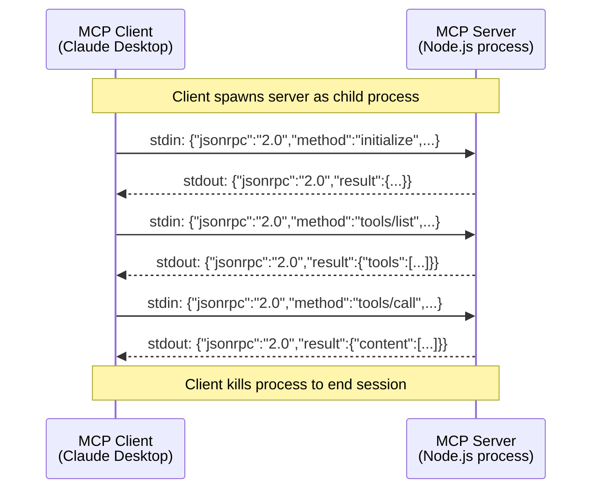

# stdio Transport

The simplest MCP transport. The client spawns the server as a child process and communicates over stdin/stdout — no network, no HTTP, no ports.

## How It Works

The MCP client (e.g. Claude Desktop) runs the server as a subprocess using a command like `node dist/cli.js`. Messages are JSON-RPC objects written to stdin (client → server) and read from stdout (server → client). stderr is available for logging.

The session starts when the process starts and ends when it exits. There's no handshake, no session ID, no connection management — just pipes.



## Sample Payloads

**Client → Server (stdin)** — Initialize:
```json
{"jsonrpc":"2.0","id":1,"method":"initialize","params":{"protocolVersion":"2025-03-26","capabilities":{},"clientInfo":{"name":"claude-desktop","version":"1.0.0"}}}
```

**Server → Client (stdout)** — Initialize response:
```json
{"jsonrpc":"2.0","id":1,"result":{"protocolVersion":"2025-03-26","capabilities":{"tools":{}},"serverInfo":{"name":"mcp-skeleton","version":"1.0.0"}}}
```

**Client → Server (stdin)** — Tool call:
```json
{"jsonrpc":"2.0","id":2,"method":"tools/call","params":{"name":"echo","arguments":{"message":"hello"}}}
```

**Server → Client (stdout)** — Tool result:
```json
{"jsonrpc":"2.0","id":2,"result":{"content":[{"type":"text","text":"Echo: hello"}]}}
```

**Server → Client (stdout)** — Server notification (no `id`):
```json
{"jsonrpc":"2.0","method":"notifications/tools/list_changed"}
```

## Key Characteristics

- **One message per line** — each JSON-RPC message is a single line on stdin/stdout
- **No framing** — newline-delimited JSON, no HTTP headers, no content-length
- **Bidirectional** — both client and server can send messages (requests and notifications)
- **No session ID** — the process _is_ the session
- **stderr for logging** — server can write debug output to stderr without corrupting the protocol

## When to Use

- Local development and testing
- Claude Desktop integration (the default mode)
- Single-user, single-machine setups
- When you don't need persistence or network access

## Limitations

- **Single client** — one process, one client connection
- **No persistence** — in-memory storage only, lost on restart
- **No network** — client and server must be on the same machine
- **No auth** — the client spawns the process, so it has full access

For multi-client or networked setups, see [Streamable HTTP](transport-streamable-http.md).

## Setup

See [stdio deployment guide](stdio.md) for Claude Desktop configuration.
