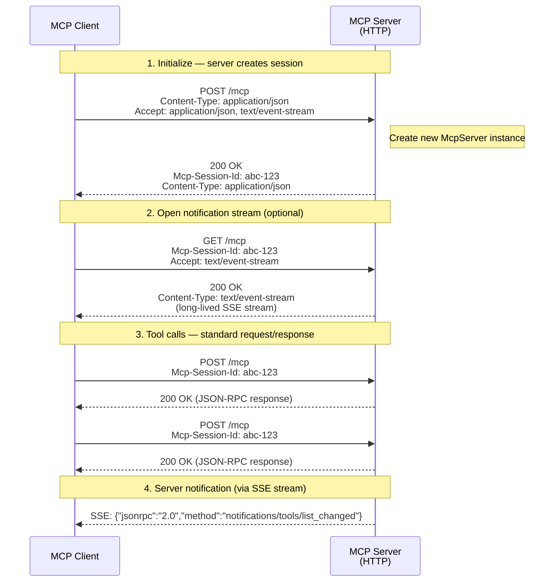

# Streamable HTTP Transport

The current standard HTTP transport for MCP, introduced in the [2025-03-26 spec revision](https://modelcontextprotocol.io/specification/2025-03-26/basic/transports#streamable-http). The server exposes a single HTTP endpoint (`/mcp`) that handles all MCP communication via standard request/response, with optional SSE streaming for server-initiated notifications.

This is the transport used by both the HTTP mode (Node.js/Docker) and the Cloudflare Worker mode in this project.

## How It Works

All communication goes through a single endpoint (`POST /mcp` for requests, `GET /mcp` for the optional notification stream). Sessions are tracked via the `Mcp-Session-Id` response header — clients include it in subsequent requests to maintain session continuity.



### Session lifecycle

1. Client sends `POST /mcp` with an `initialize` request (no session ID)
2. Server creates a new `McpServer` instance and returns a `Mcp-Session-Id` header
3. Client includes `Mcp-Session-Id` in all subsequent requests
4. Session ends when the client disconnects or the server is stopped

Each client gets its own isolated `McpServer` instance — sessions are never shared.

## Sample Payloads

### Initialize (creates session)

**Request:**
```http
POST /mcp HTTP/1.1
Host: localhost:3000
Content-Type: application/json
Accept: application/json, text/event-stream

{
  "jsonrpc": "2.0",
  "id": 1,
  "method": "initialize",
  "params": {
    "protocolVersion": "2025-03-26",
    "capabilities": {},
    "clientInfo": {
      "name": "claude-desktop",
      "version": "1.0.0"
    }
  }
}
```

**Response:**
```http
HTTP/1.1 200 OK
Content-Type: application/json
Mcp-Session-Id: a1b2c3d4-e5f6-7890-abcd-ef1234567890

{
  "jsonrpc": "2.0",
  "id": 1,
  "result": {
    "protocolVersion": "2025-03-26",
    "capabilities": {
      "tools": {}
    },
    "serverInfo": {
      "name": "mcp-skeleton",
      "version": "1.0.0"
    }
  }
}
```

### Tool call (within session)

**Request:**
```http
POST /mcp HTTP/1.1
Host: localhost:3000
Content-Type: application/json
Mcp-Session-Id: a1b2c3d4-e5f6-7890-abcd-ef1234567890

{
  "jsonrpc": "2.0",
  "id": 2,
  "method": "tools/call",
  "params": {
    "name": "echo",
    "arguments": {
      "message": "hello"
    }
  }
}
```

**Response:**
```http
HTTP/1.1 200 OK
Content-Type: application/json

{
  "jsonrpc": "2.0",
  "id": 2,
  "result": {
    "content": [
      {
        "type": "text",
        "text": "Echo: hello"
      }
    ]
  }
}
```

### Notification stream (optional SSE)

**Request:**
```http
GET /mcp HTTP/1.1
Host: localhost:3000
Accept: text/event-stream
Mcp-Session-Id: a1b2c3d4-e5f6-7890-abcd-ef1234567890
```

**Response (SSE stream):**
```http
HTTP/1.1 200 OK
Content-Type: text/event-stream
Cache-Control: no-cache
Connection: keep-alive

event: message
data: {"jsonrpc":"2.0","method":"notifications/tools/list_changed"}

event: message
data: {"jsonrpc":"2.0","method":"notifications/resources/list_changed"}
```

The GET stream is long-lived — the server pushes notifications as they occur. This is optional; many clients work fine without it (tool calls via POST still return responses inline).

## Key Characteristics

- **Single endpoint** — `/mcp` handles both POST (requests) and GET (notification stream)
- **Session via header** — `Mcp-Session-Id` replaces connection-based sessions
- **Stateless HTTP** — each POST is a standard request/response; no persistent connection required
- **Optional SSE** — the GET notification stream is only needed if the server sends unprompted notifications
- **Standard infrastructure** — works with load balancers, reverse proxies, CDNs, and serverless platforms

## When to Use

- Docker or VPS deployments (multi-client, networked)
- Cloudflare Workers (serverless, global edge)
- Any environment where HTTP is available
- When you need session isolation, persistence, or authentication

## Differences from SSE Transport

See [SSE transport](transport-sse.md) for a detailed comparison. The key difference: SSE transport requires a long-lived SSE connection for the entire session, while Streamable HTTP uses stateless POST requests with an optional SSE stream.

## Setup

- [Docker deployment](docker.md) — HTTP server in a container
- [Cloudflare Worker](cloudflare-worker.md) — serverless deployment with KV storage
- [OAuth authentication](oauth.md) — secure the endpoint with OAuth 2.0
